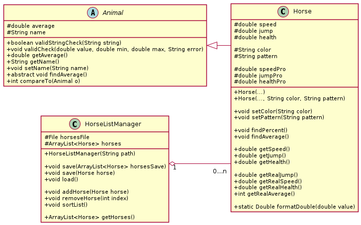

# Horse Statistics Manager

Javafx application made for managing and sorting minecraft horses based on the average of the three raw statistics numbers from the game, which are speed, jump height and health. The intended purpose is to easily find the two best horses in you collection and thereby making it easy to figure out which two horses to breed.

It is currently under development and subject to active change, so I will not explain the project structure in more detail than in the origin section.

### Origin

This application started as a university project for the course TDT4100 Object-Oriented Programming Spring 2026 at NTNU. The below image shows the class structure from the original submission, it features the 3 logic handling classes in the program. 

Animal.java is an abstract superclass that implements the interface Comparable, the purpose of having the superclass is to allow other animals from minecraft (such as Donkeys) to be easier to implement in the future. Currently only the Horse class extends the Animal class. The Animal/Horse class handles the logic that goes into validating input (not error handling) and calculation of the average, on which the horses gets sorted.

HorseListManager.java is the class that handles loading and saving to file, additions, removals, and soriting.

---

HorseStatController.java handles user input and updates the view, all actions that manage the horses are delegated to HorseListManager.java.

HorseStatApp.java is the launcher/main class 

--- 

## LICENCE

MIT License - Copyright (c) 2026 Sofus Højberg Lind

